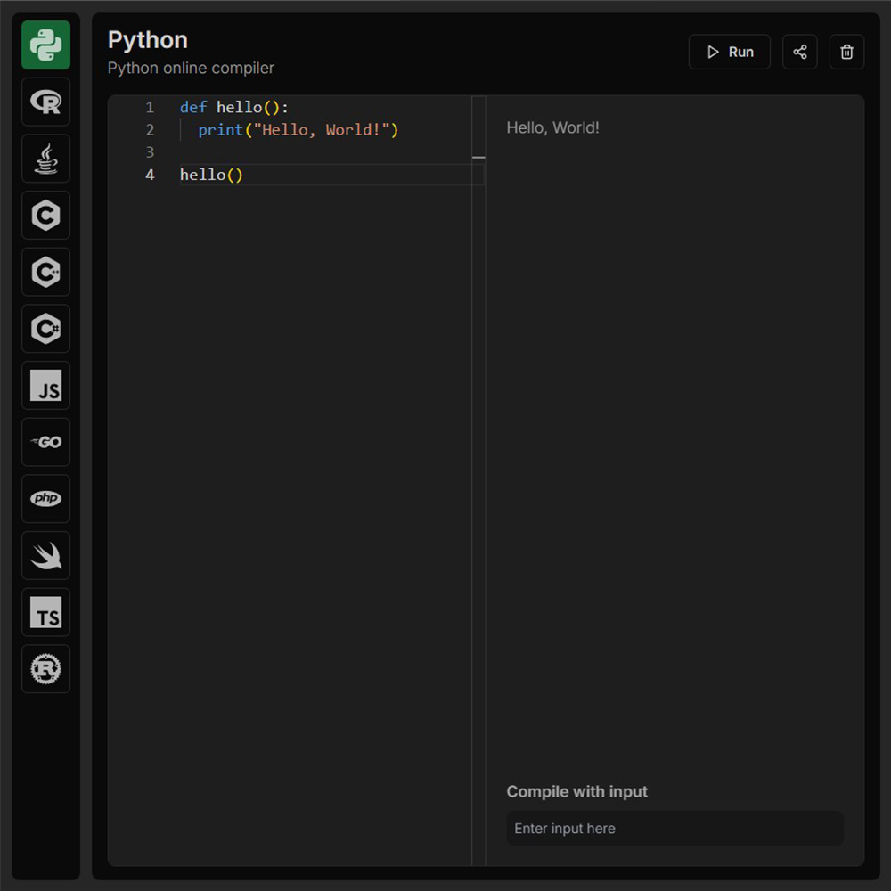

# Codelix Online Compiler

Elevate your coding experience with our online code compiler, built using Next.js! This platform allows users to write, compile, and execute code in various programming languages directly from their web browsers.

Whether you're a student learning to code, a developer testing new ideas, or a teacher facilitating coding exercises, our Next.js-based online code compiler is your go-to solution for efficient coding and collaboration!

## Requirements

- Basic Javascript knowledge.
- Basic React JS and Next JS knowledge.
- Basic TailwindCSS knowledge.
- Basic API Integration knowledge.

## How to Install & Run

To run the application, follow these steps:

1. Clone the repository or download it as a ZIP file.
2. In a terminal, navigate to the folder where the application is located.
3. Run the **npm install** command to install all the necessary dependencies.

```shell
npm install
```

4. Run the **npm run dev** command to start the application in development mode.

```shell
npm run dev
```

5. Open your browser and navigate to **http://localhost:3000** to use the application.

```shell
http://localhost:3000
```

## Application Features

Unlock your coding potential with our powerful online code compiler, designed with Next.js for a seamless user experience! This platform allows you to write, compile, and execute code in a variety of programming languages directly from your browser.

- Multiple Language Support: Compile and run code in popular languages such as JavaScript, Python, Java, C++, Ruby, Go, and more, making it a versatile tool for all programmers.
- Real-Time Execution: Write code and view results instantly, allowing for rapid development and debugging without the hassle of local setup.
- User-Friendly Interface: Enjoy an intuitive and responsive design that makes coding easy for both beginners and experienced developers.
- Code Sharing & Collaboration: Easily share your code snippets with others via unique links, fostering collaboration and peer learning.
- Secure Sandbox Environment: Execute code in a safe, isolated environment to protect your system from any potential threats.
- Syntax Highlighting: Benefit from clear and readable code with syntax highlighting that enhances your coding experience.
- Customizable Themes: Choose from various themes to personalize your coding environment according to your preferences.
- Interactive Tutorials: Access built-in tutorials and examples to help you learn new languages and frameworks right from the platform.
- Save & Retrieve Projects: Save your projects for future reference and easily retrieve them anytime, allowing you to continue your work seamlessly.

## Technologies Used

- Next.js: A powerful React framework for building fast and scalable web applications with server-side rendering capabilities.
- ShadCN UI: A modern component library that streamlines UI development, providing pre-designed components for quick implementation.
- Tailwind CSS: A utility-first CSS framework that enables rapid and responsive styling, allowing for a highly customizable design.
- API Integration: Seamlessly connects to backend services for code execution and data retrieval, enhancing functionality and user experience.

## Contribution

If you'd like to contribute to this project, feel free to submit a pull request. Before doing so, be sure to create a separate branch for your changes.

## Buy A Coffee

Like my works and want to support me?

<a href="https://www.buymeacoffee.com/hossainpalin" target="_blank"></a>

## Screenshots



## Live demo

Live previews are the best way for a better understanding of the application's user interface.

[Click here...](https://codelixx.vercel.app/)
